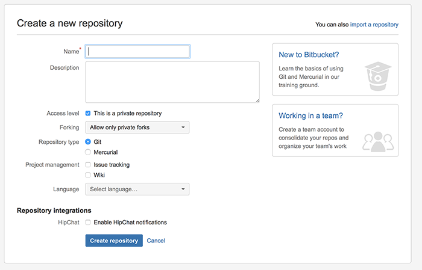
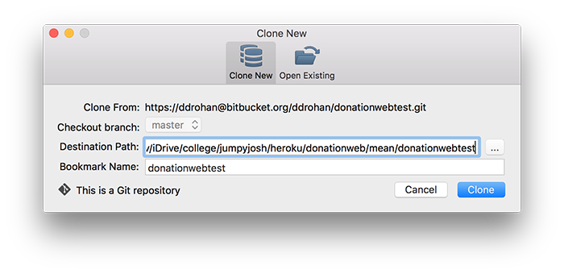
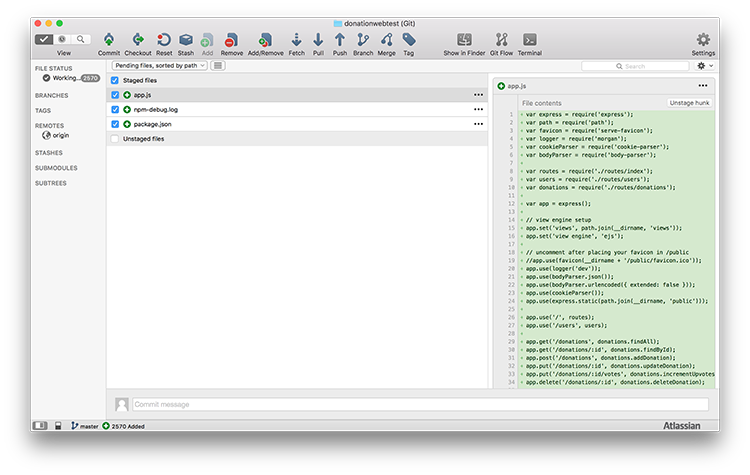
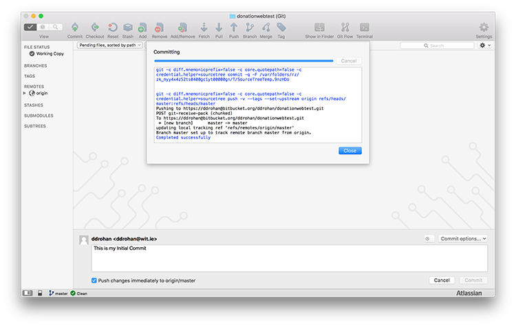
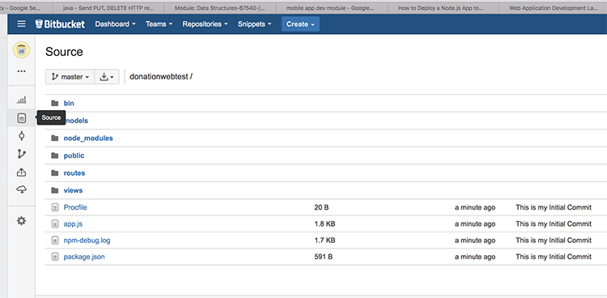

# Step 02 - Using BitBucket & SourceTree

Once you have your BitBucket account set up, go ahead and create a new repository

In this lab I'll be naming it <b>donationwebtest</b> but once you call it something relevant you'll be fine.

I also set the language to <b>Javascript</b> (as below) but this is purely for completeness

You now have a number of different options to populate your repository (repo) but we're going to use <b>SourceTree</b> for this, so go ahead and choose 'Clone in SourceTree'

Click the 'Commit' button and enter a brief description

