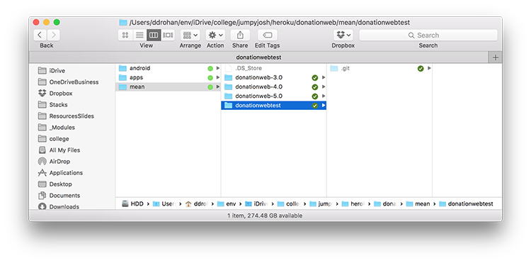
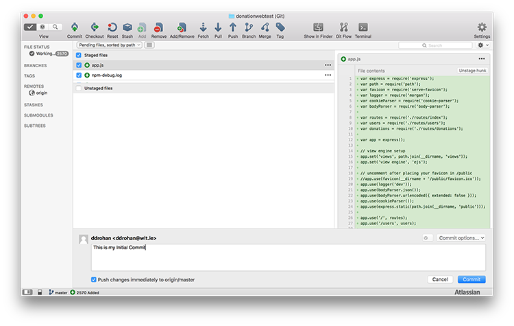
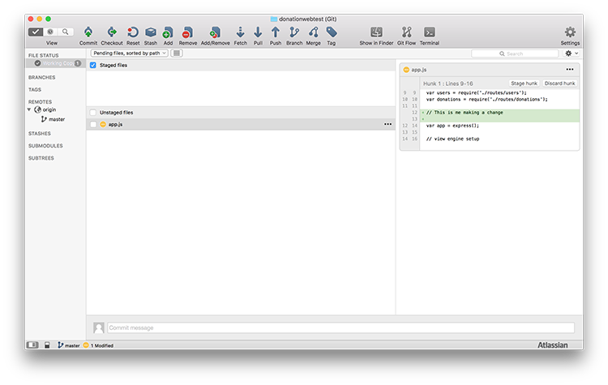

# Step 02 - Using BitBucket & SourceTree

Once you have your BitBucket account set up, go ahead and create a new repository

In this lab I'll be naming it <b>donationwebtest</b> but once you call it something relevant you'll be fine.

I also set the language to <b>Javascript</b> (as below) but this is purely for completeness

You now have a number of different options to populate your repository (repo) but we're going to use <b>SourceTree</b> for this, so go ahead and choose 'Clone in SourceTree'

Choose a local folder to 'sync' with your remote repo and click 'Clone'. This will now create a local copy of your remote repo you've just created on BitBucket - but it's empty, so let's add some files to our repo.

Navigate to you local folder in Windows Explorer or Finder and copy in some files - in this Example I'm copying in the solution to our donationweb-5.0 web app, but be careful <b>NOT</b> to copy the hidden .git folder

If you now switch back to SourceTree, you'll see a list of all the files in our local folder that have yet to be <i>pushed</i> and/or <i>committed</i> to our remote repo.

'Tick' the unstaged file checkbox and you'll get something like this

Click the 'Commit' button and enter a brief description

and all our files will be synced with our remote BitBucket repo.

Now, visit your previously created repo online, go to the 'source' option, and you should see the same list of files - Congratulations! You've just committed your first set of file to a remote repository (which you can share, clone, etc.)

