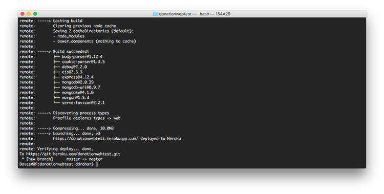
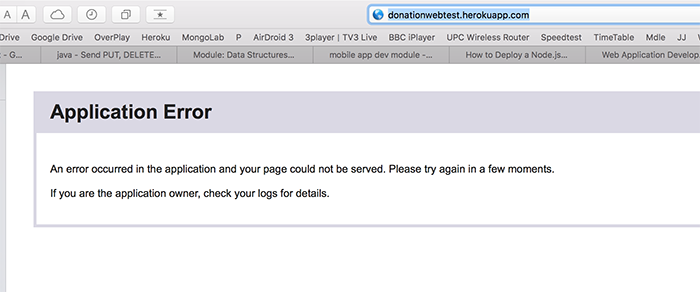

# Step 03 - The Heroku Toolbelt

At this stage you can now create repositories and manage you projects and files through git and Bitbucket + SourceTree. To actually deploy a Node Web App to Heroku you need the <b>Heroku Toolbelt</b>. 

The Heroku toolbelt will give us access to the Heroku Command Line Utility, as well as git, (tools we’ll use later).

After you've installed the Toolbelt, you have access to the heroku commands. Go into your command line and type:

~~~
$ heroku
~~~

You get a full list of the available Heroku commands, but we'l only be using a few of them.

The next step is to login to your (already created!) Heroku account, so at the command line, type
~~~
$ heroku login
~~~

~~~
$ heroku create donationwebtest
~~~

Visit your Heroku Account online to confirm your app was created successfully.

~~~
$ git push heroku master
~~~

