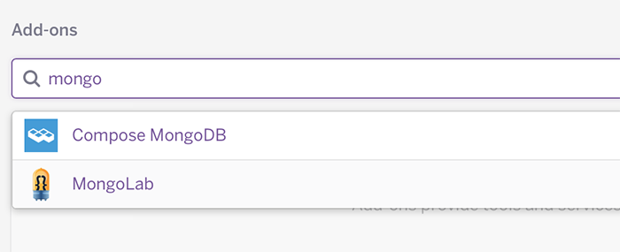
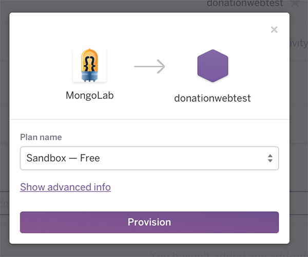
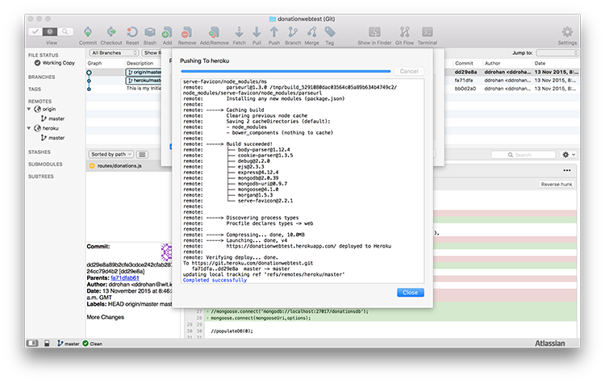

# Step 04 - Heroku & MongoLab

As previously mentioned, the web app didn't load correctly. It failed to launch due to no backend database present - this final step will take you through the process of setting up a mongodb database via one of Heroku's many addons <b>MongoLab</b>

First, visit your Heroku dashboard for your web app and select the ' Resources' tab

In the 'Add-ons' Search box, enter mongo (or mongolab to be complete)

and select the 'mongoLab' Add-on. 'Provision' the Free Sandbox Plan, and the MongoLab Add-on will be added to your web app.

Now, select the new Add-on and you'll be taken to the associated MongoLab Account

and a randomly generated database (as below)

The connection string is very important

## THE END!