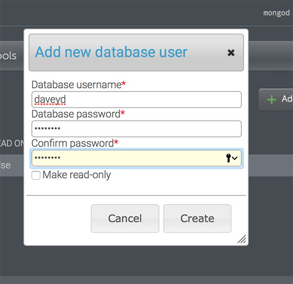
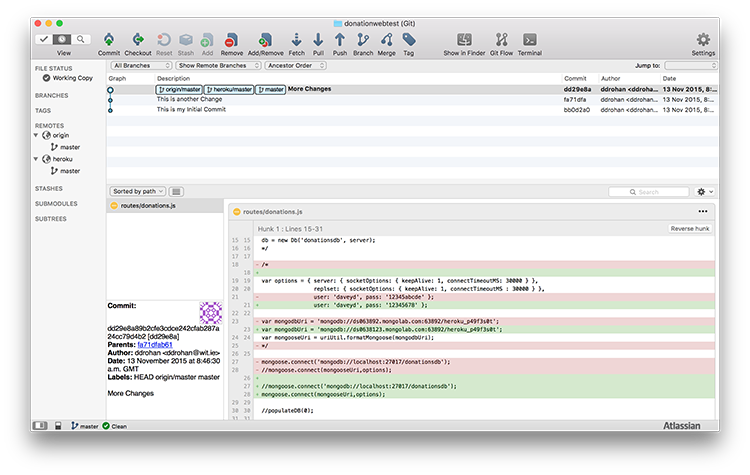
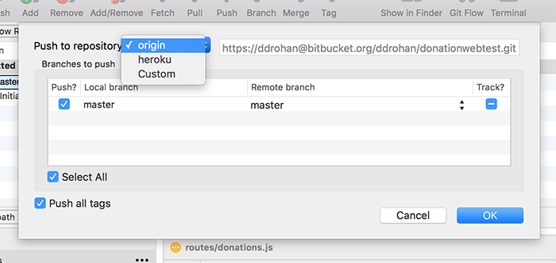
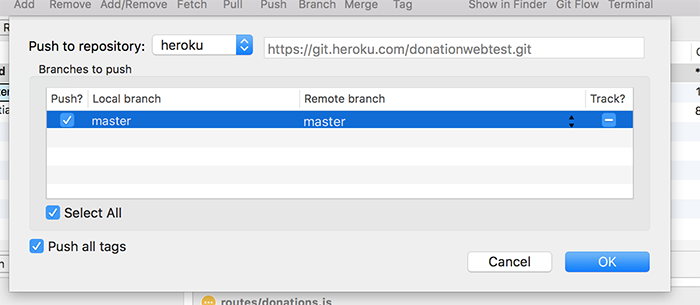
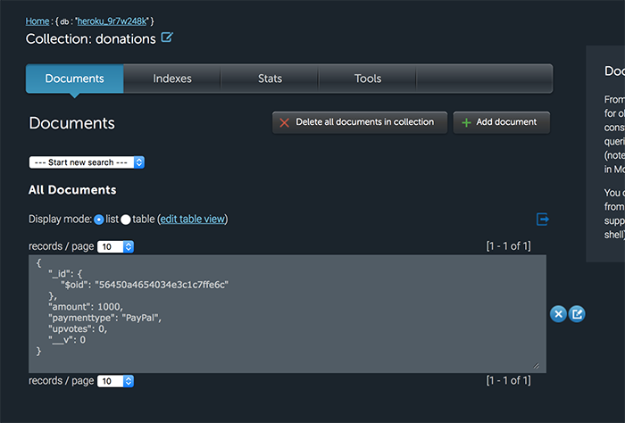

# Step 04 - Heroku & MongoLab

As previously mentioned, the web app didn't load correctly. It failed to launch due to no backend database present - this final step will take you through the process of setting up a mongodb database via one of Heroku's many addons <b>MongoLab</b>

First, visit your Heroku dashboard for your web app and select the ' Resources' tab

In the 'Add-ons' Search box, enter mongo (or mongolab to be complete)

and select the 'mongoLab' Add-on. 'Provision' the Free Sandbox Plan, and the MongoLab Add-on will be added to your web app.

Now, select the new Add-on and you'll be taken to the associated MongoLab Account

and a randomly generated database (as below)

The connection string is very important, as this is how we will connect to our mongo database in our web app.

There is also a default user set up, but I find it easier to add a new user (as it's easier to remember the username and password that we'll need later to connect to our database in our javascript code).

So go ahead and create/add a new user.

You can delete the default user if you wish, but it's not a requirement for all this to work. Here, we now have only 1 user - daveyd (me!).

The penultimate step is to set up the connection in your node web app, so go to your routes file 'donations.js' (in our example) and configure your web app to connect to the mongodb database and not your local db, as is currently the case.

Something like this

~~~
var options = { server: { socketOptions: { keepAlive: 1, connectTimeoutMS: 30000 } }, 
                replset: { socketOptions: { keepAlive: 1, connectTimeoutMS : 30000 } },
                user: 'YOURMONGODBUSERNAME', pass: 'YOURMONGODBPASSWORD' };  

//ENTER YOUR MONGODB CONNECTION STRING HERE IN PLACE OF MY ONE
var mongodbUri = 'mongodb://ds063XXX.mongolab.com:63892/heroku_XXXXXXXX';
var mongooseUri = uriUtil.formatMongoose(mongodbUri);

//mongoose.connect('mongodb://localhost:27017/donationsdb');
mongoose.connect(mongooseUri,options);

~~~

## THE END!