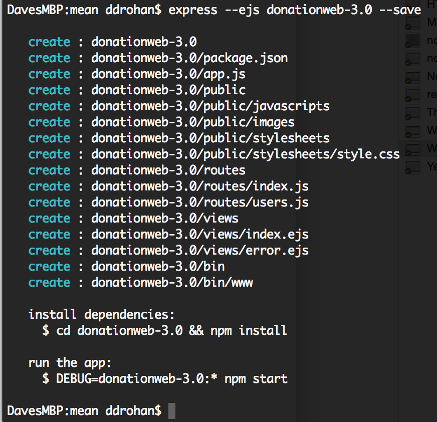
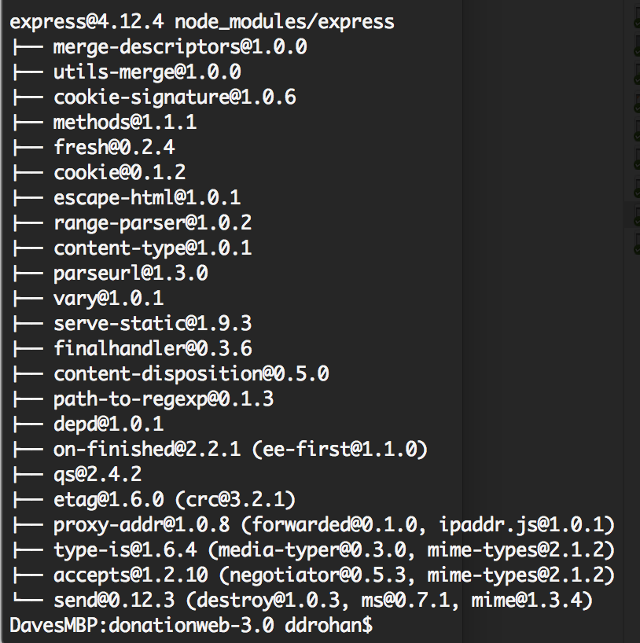
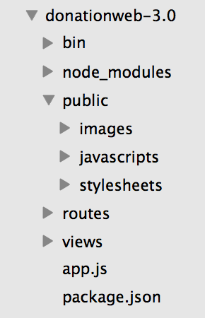
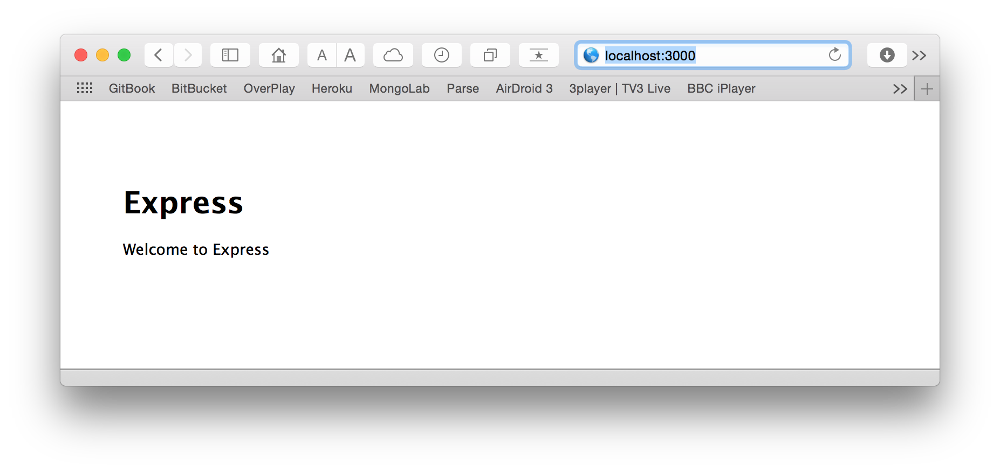

# Step 2 - Setup


We're going to build our first Node/Express web app using **WebStorm**, so (assuming you already have it installed) launch your WebStorm IDE and create a new Node/Express Project as follows;


and you should get something like this


and make sue you choose **EJS** as the templating option (more on this later)




As you can see, this will auto-generate a node web app, creating all the necessary folders and files we need to get started. *--ejs* specifies we want to use the **Embedded JavaScript Templates** (instead of the default which is Jade) and *--save* just ensures the dependencies are added to our *package.json* file (more on this later).

Now, follow the instructions to install the dependencies, and you should get something like this (+ a lot more!)



And once you've dragged it into Sublime Text you should have something like this



Finally, navigate to your **donationweb-3.0** folder and type the following to launch the server

```
npm start

```

if everything goes to plan you should be able to visit [http://localhost:3000](http://localhost:3000) and see the following



The next step will involve bringing in our angular files to get the front-end implemented.