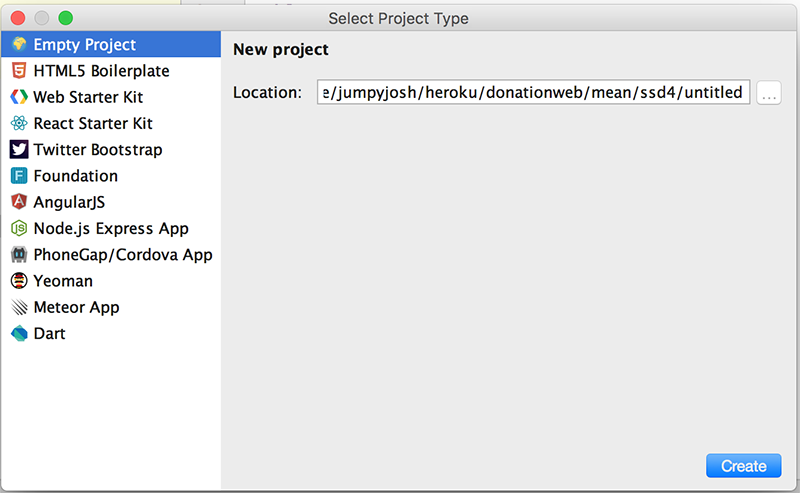

# Step 2 - Setup

We're going to build our first Node/Express web app using **WebStorm**, so (assuming you already have it installed) launch your WebStorm IDE and create a new Node/Express Project as follows;

So select 'Create New Project' and you should get something like this

Select a 'Node.js Express App'

and browse to the location you want to store your project files. It's probably a good idea to store all your web apps in a single folder (ssd4 for me here) and create a new folder for our specific web app **donationwebstorm** (as below).

and make sue you choose **EJS** as the templating option (more on this later)

As you can see below, this will auto-generate a node web app, creating all the necessary folders and files we need to get started. *EJS* specifies we want to use the **Embedded JavaScript Templates** (instead of the default which is Jade).

Now, click on the 'play' button to run/launch your Web App..

If everything goes to plan you should be able to visit [http://localhost:3000](http://localhost:3000) in your browser, and see the following

Now, if you'd rather your browser launch automatically you can configure you 'Run' options

and choose the Browser you prefer

Just be sure to 'tick' the 'After Launch' check box

The next step will involve customising our home page (although customising is a bit of a stretch!)