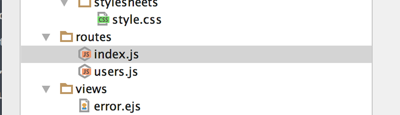
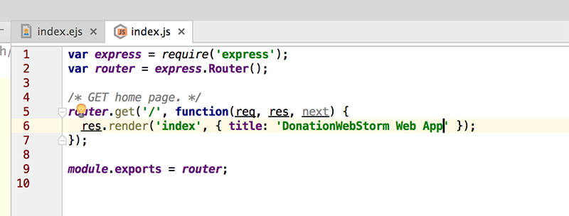

# Step 3 - Customising our Home Page

Before we make a start launch your app again and confirm that it automatically launches your preferred browser as well

Now, navigate to you 'routes' folder

Open up the **index.js** file, and replace the default title value with this one

~~~javascript
'DonationWebStorm Web App'
~~~

Launch your app again and your project should now look something like this

**Well Done!! - You've just created, customised and deployed your first Node Web App**

