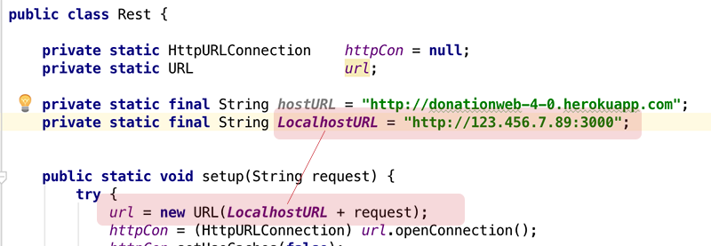
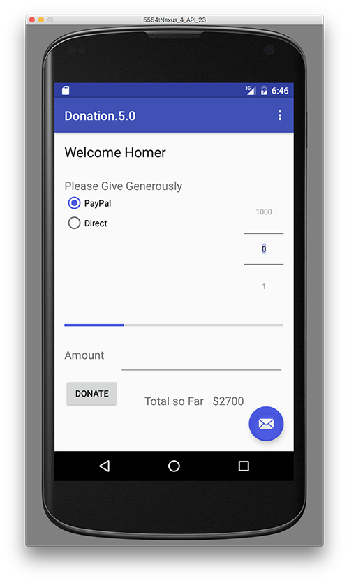
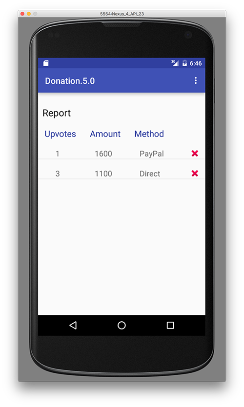

# Step 6 - Android App REST APi Integration

We will eventually be using our previously developed Android App to make client requests on a deployed version of our MEAN Web App but for now you can actually run your server locally and connect with your Android App as follows;

---

###1. Find your IP address

run ***ipconfig*** (windows) or ***ifconfig*** (mac) to get your machines IP address.

###2. Update your Host URL in Android REST APi

###3. Test your Android App

**Initially Launch of App (Total is $2700, from Node Web APi)**

**List all our Donations in the Report**

**Upvote a Donation (using the WebStorm REST Client)**

