# Step 4 - Adding our 'Routes', Part 1 ( 'findAll' & 'findOne')

With our "backend" model in place, it's now time to open some routes that a client can interact with. The following are a list of actions a user can perform:

* view all donations
* Find a single donation
* Add a new donation
* Upvote a donation
* Delete a donation


The actions map directly to several routes, which are described as follows:

* GET **/donations** - return a list of donations and associated metadata
* GET **/donations/:id** - return an individual donation with associated metadata
* POST **/donations** - create a new donation
* PUT **/donations/:id/upvote** - upvote a donation, notice we use the donation ID in the URL
* DELETE **/donations/:id** - delete a donation by ID


---
Before we proceed, WebStorm has a very nice (and useful!) feature to assist the developer in writing javascript - **Code Assistance**, which happens to disabled by default, so we need to turn it on, as follows;

File->Default Settings

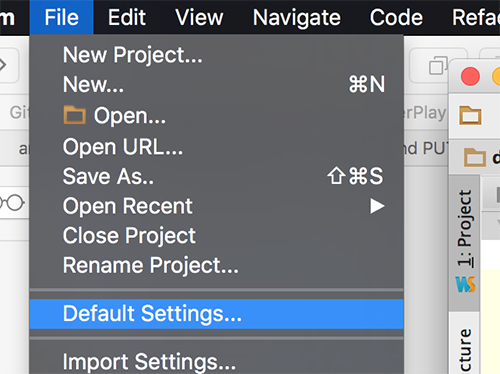

Languages & Frameworks->Node.js & NPM

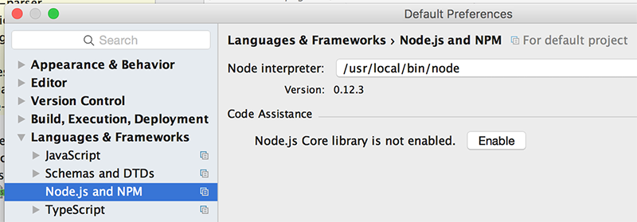

**Enable ** Node.js Core Library

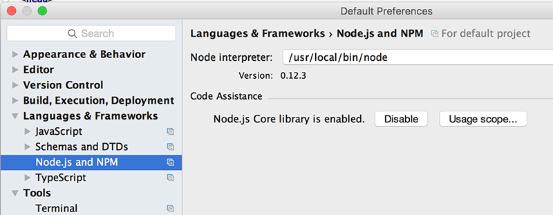

---

## Creating Our First Route - 'List All Donations'

To keep things organised we will be defining these routes in a **routes/donations.js** file, so create a new file 'donations.js' in the existing 'routes' folder in your project.

Let's begin by opening up the first route we listed, which should return a **JSON** list containing all donations. We start by creating a function (***findAll***) for retrieving donations in our **routes/donations.js** file.

```javascript
var donations = require('../models/donations');
var express = require('express');
var router = express.Router();

router.findAll = function(req, res) {
  // Return a JSON representation of our list
    res.json(donations);
}

module.exports = router;
```
We make sure we import **express** and have a handle to our donations model. By right, we should have some error handling in there, but we'll be optimistic!

Next, inside our **app.js** we need to define the actual route which will trigger the above function so add this around line 26/27 (there'll be another, similar, route around that line so just add it after it)

```javascript
app.get('/donations', donations.findAll);
```
to add the actual ***GET*** APi route.

Now, try and run your app and see what happens....

You probably got something like this

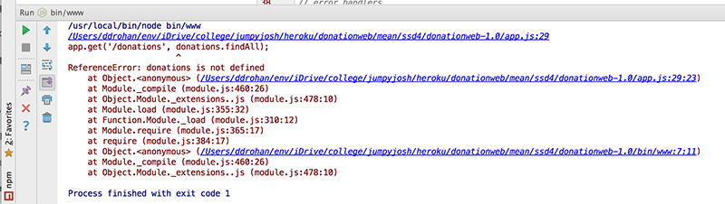

We're trying to call a function 'findAll' on an object (donations) that the js interpreter can't find.

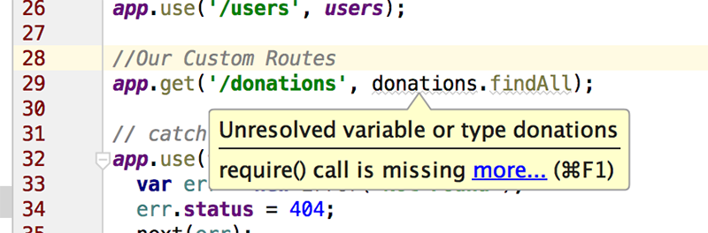

Ordinarily, we'd have to manually add in the javascript we need, but we can get WebStorm to do this for us - highlight the error and hit Alt+Enter (on a Mac) and you get the following;

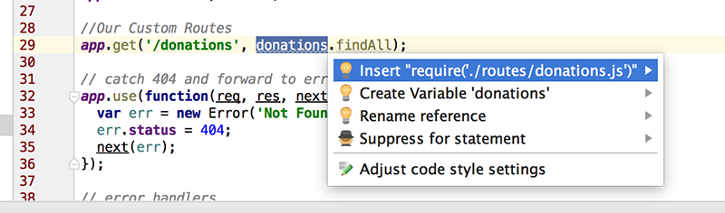

Choose the first 'fix' and the necessary 'requires' statement is added to our js file - kinda handy don't you think?!

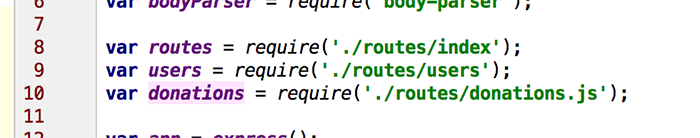

Now, to actually test our APi we need to launch our Server again and point the browser at [http://localhost:3000/donations](http://localhost:3000/donations) and we should get back a json string of our data, like so.


Over time, this would probably become a bit time consuming, but WebStorm to the rescue again :) there's a feature to **Test RESTful Web Service**, so launch that like so

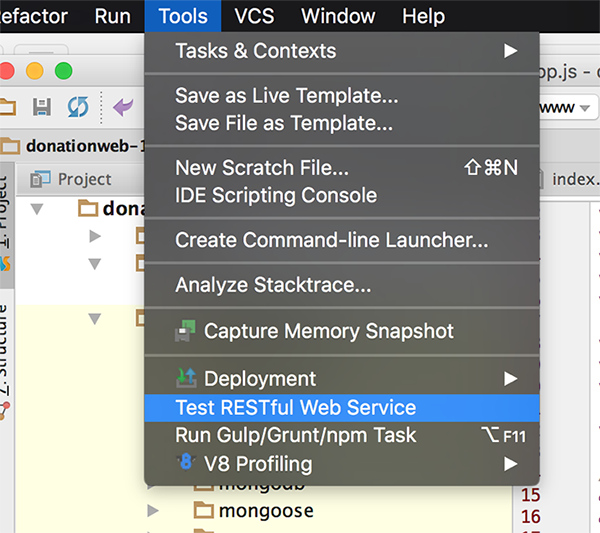

and you get the **REST Client** window, so select/type in the following for out test request

* HTTP Method **GET**
* Host/port **http://localhost:3000**
* Path **/donations**

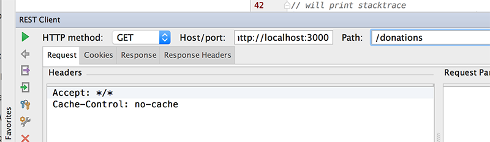

On the 'Request' tab, update the 'Accept' Header **application/json**

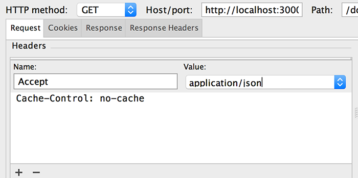

and 'play' the request

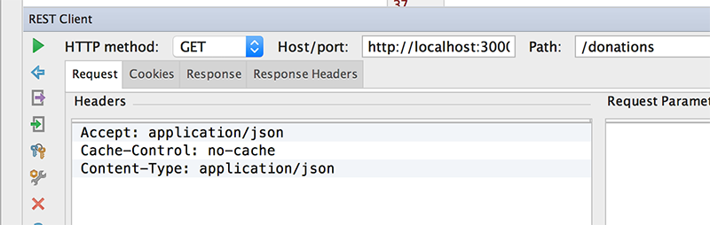

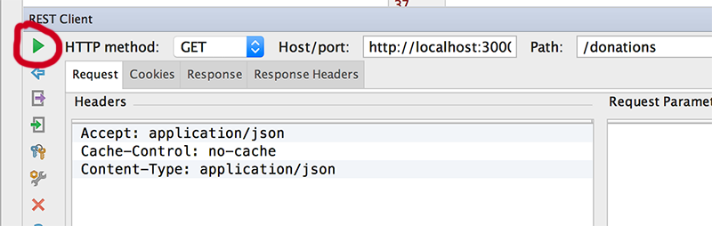

If everything goes according to plan, you'll see the same json list of donations.

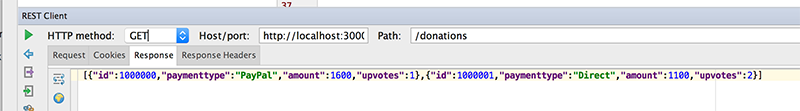


You could continue to use the browser to test the APi, but things will get a bit tricky when we want to test our add & update requests so we'll stick with the REST Client for the moment.

---
## Creating Our Second Route - 'findOne'

Our first route returned all the donations to a client, but what if the client only want's to get at a single donation - that's what our next route 'findOne' will do.


Here's the function (***findOne***) to be added to our **routes/donations.js** file

```javascript
router.findOne = function(req, res) {

    var donation = getByValue(donations,req.params.id);

    if(donation != null)
        res.json(donation);
    else
        res.json({ message: 'Donation NOT Found!'});
}
```
and our route for **app.js**

```javascript
app.get('/donations/:id', donations.findOne);
```
You've probably noticed (or maybe you didn't!) that there's a 'helper' function (***getByValue***) we need to write for our 'findOne' function to work properly.


Here's the function stub, so see can you work out how to find the donation object in ***arr*** with ***id*** id and return it.

```javascript
function getByValue(arr, id) {

// put your code solution here
    
}
```
---
### Testing Our 'findOne' Route

Now that we have another GET 'service' in our RESTful APi, we should really test it via our REST Client.

###The Request

GETing donation with id '1000001'
~~~html
/donations/1000001
~~~

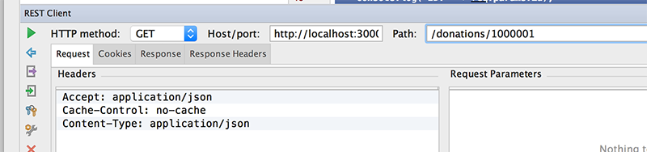

###The Response

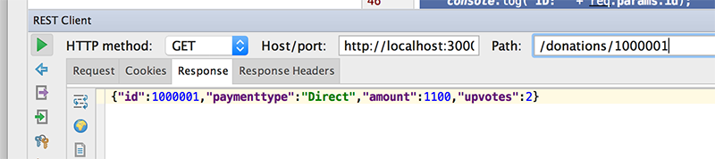

requesting donation with id '10000011'
~~~html
/donations/10000011
~~~

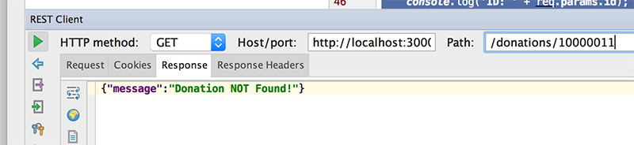

---