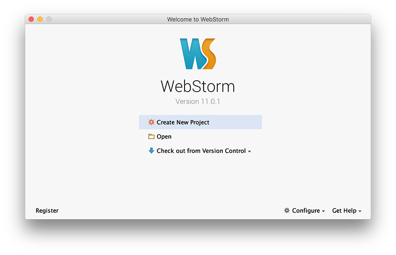
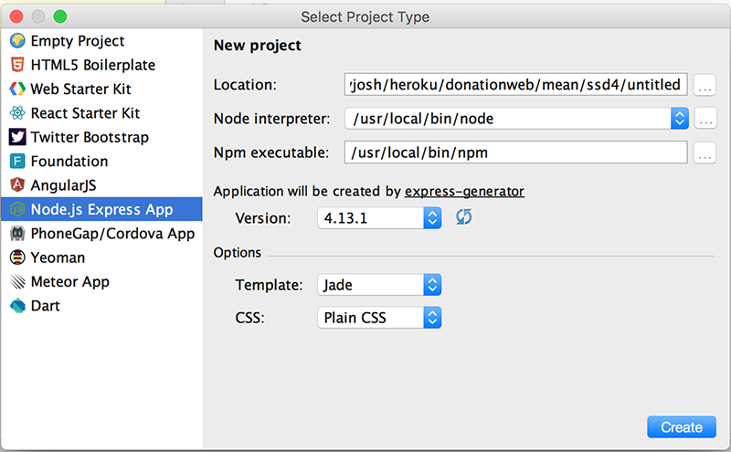

# Step 2 - Project Setup

We're going to build our first Node/Express DonationWeb project, so (assuming you already have it installed) launch your WebStorm IDE and create a new Node/Express Project as follows;

Select 'Create New Project' and you should get something like this

Select a 'Node.js Express App'

and browse to the location you want to store your project files. It's probably a good idea to store all your web apps in a single folder (ssd4 for me here) and create a new folder for our specific web app **donationweb-1.0** (as below).

and make sue you choose **EJS** again as the templating option (like before)

Your project should now look like this

Once again, click on the 'play' button to run/launch your Web App..

if you've followed all the steps correctly you should be able to run your app (or visit [http://localhost:3000](http://localhost:3000)) and see the following

Now, if you'd rather your browser launch automatically you can configure you 'Run' options and choose the Browser you prefer

Just be sure to 'tick' the 'After Launch' check box

Close the browser tab/window and run your app again, to confirm your new run configuration is correct.

The next step will involve customising our home page (although customising is a bit of a stretch!)