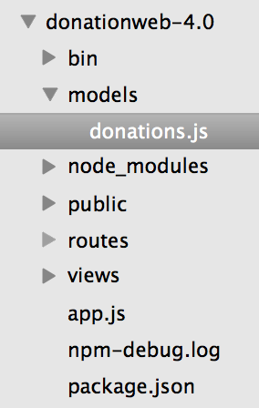

# Step 3 - Creating our 'Model'

Before we can think about accessing data on our Server via a RESTful APi, we first need the actual data :) , so this step will involve creating a list of 'Donations' that we can 'expose' via our APi.

The first thing we need to do is create a new directory in our root directory called ***models/*** and within that directory create a new file called **donations.js**.

Now, paste the following code into your newly created .js file

```javascript
var donations = [
				 {id: 1000000, paymenttype: 'PayPal', amount: 1600, upvotes: 1}, 
				 {id: 1000001, paymenttype: 'Direct', amount: 1100, upvotes: 2}
				];

module.exports = donations;
```
Notice the extra field (id) in our model, this will be useful later on for deleting etc.

Your project should now look something like this

