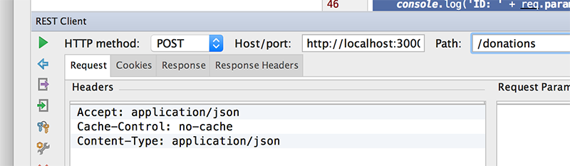
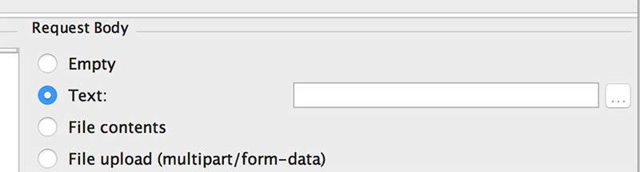
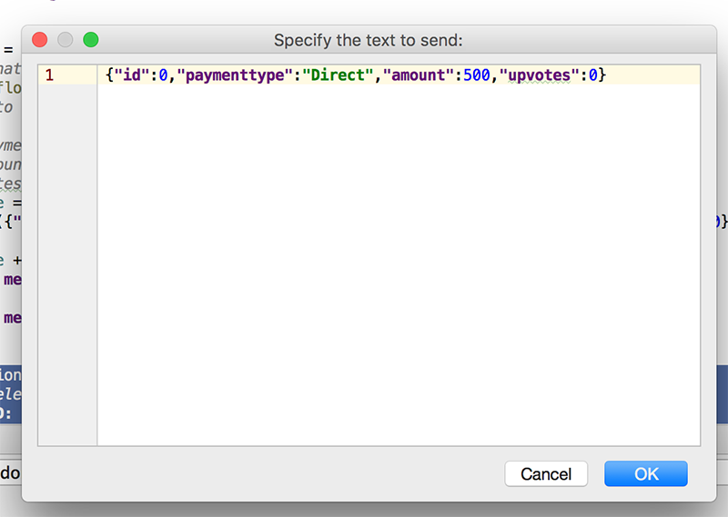
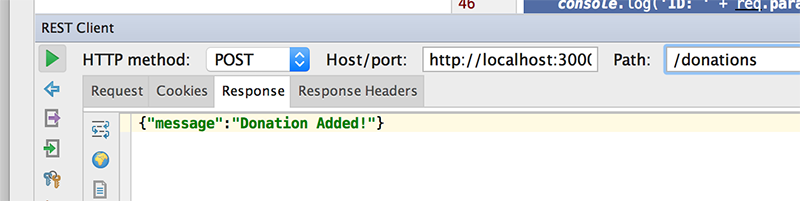
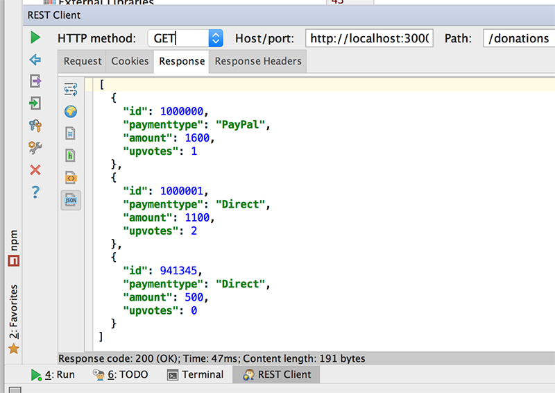
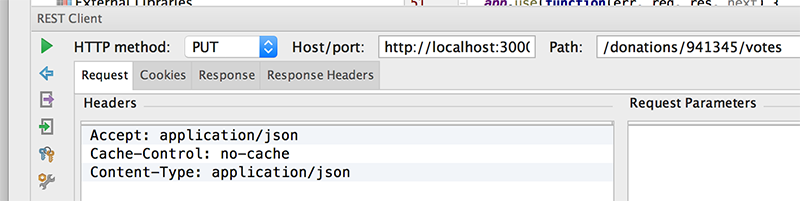
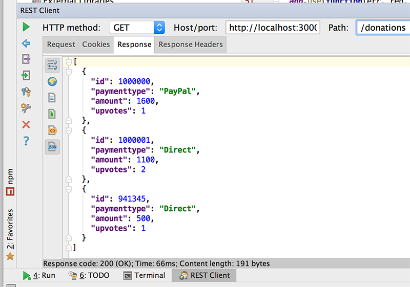
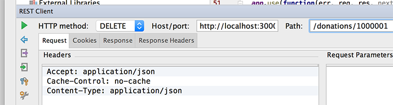
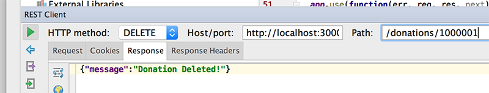
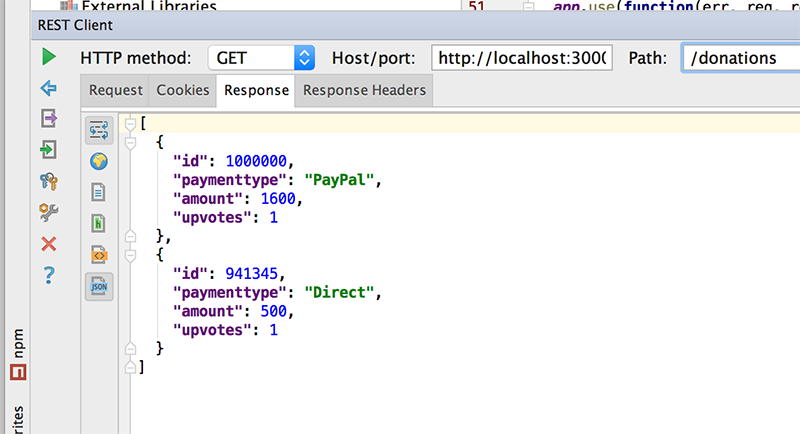

# Step 5 - Adding our 'Routes', Part 2 ('addDonation', 'deleteDonation' & 'incrementUpvotes')

Before we go any further, here's the missing code from the previous step

```javascript
function getByValue(arr, id) {

    var result  = arr.filter(function(o){return o.id == id;} );

    return result ? result[0] : null; // or undefined
}
```

Recall our routes, described as follows:

* GET **/donations** - return a list of donations and associated metadata
* GET **/donations/:id** - return an individual donation with associated metadata
* POST **/donations** - create a new donation
* PUT **/donations/:id/upvote** - upvote a donation, notice we use the donation ID in the URL
* DELETE **/donations/:id** - delete a donation by ID

We've already implemented the first two, so now let's have a go at 

* Adding a new donation
* Deleting a donation and
* 'Upvoting' a donation

---
## Creating Our 'Add' Route - 'addDonation'
Similar to the previous step, we start by creating a function (***addDonation***) for adding a single donation in our **routes/donations.js** file

```javascript
router.addDonation = function(req, res) {
    //Add a new donation to our list
    var id = Math.floor((Math.random() * 1000000) + 1); //Randomly generate an id
    // parameters to store
    // id (for id)
    // req.body.paymenttype (for paymenttype)
    // req.body.amount (for amount)
    // 0 (for upvotes)
    var currentSize = donations.length;
    
    donations.push(/*add the relevant code here*/);

    if((currentSize + 1) == donations.length)
        res.json({ message: 'Donation Added!'});
    else
        res.json({ message: 'Donation NOT Added!'});
}
```
Notice we only return a json message confirming (or Not) we've added the donation.

Next, inside our **app.js** we need to define the actual route which will trigger the above function so keeping in mind the route is **/donations** with a **POST** request, see can you make the necessary additions?

---
### Testing Our 'Add' Route

Now that we have a POST 'service' in our RESTful APi, let's test it via our REST Client.

###The Request



We need to fill in the **Request Body** for our POST



POSTing donation data in JSON format

~~~json
{"id":0,"paymenttype":"Direct","amount":500,"upvotes":0}
~~~




###The Response



GET all donations again to confirm



---
---
## Creating Our 'Upvote' Route - 'incrementVotes'

Here's what we need to implement the 'Upvote' route

**routes/donations.js**

```javascript
router.incrementUpvotes = function(req, res) {
    //Add 1 to upvotes property of the selected donation based on its id
    var donation = getByValue(donations,req.params.id);
    donation.upvotes += 1;
}
```

**app.js**

```javascript
app.put('/donations/:id/votes', donations.incrementUpvotes);
```
---
### Testing Our 'Upvote' Route

Now that we have a PUT 'service' in our RESTful APi, let's test it via our REST Client.

###The Request

UPDATEing donation votes with id '941345'
~~~html
/donations/941345/votes
~~~



###The Response



---
## Creating Our 'Delete' Route - 'deleteDonation'
Again, we start with the function in our **routes/donations.js** file

```javascript
router.deleteDonation = function(req, res) {
    //Delete the selected donation based on its id
    var donation = getByValue(donations,req.params.id);
    var index = donations.indexOf(donation);

    var currentSize = donations.length;
    donations.splice(index, 1);

    if((currentSize - 1) == donations.length)
        res.json({ message: 'Donation Deleted!'});
    else
        res.json({ message: 'Donation NOT Deleted!'});
}
```
and update our **app.js** accordingly

```javascript
app.delete('/donations/:id', donations.deleteDonation);
```

Notice we are using our own 'lookup' function to find a particular donation but be sure you understand how it works....

---
### Testing Our 'Delete' Route

Now that we have a DELETE 'service' in our RESTful APi, let's test it via our REST Client.

###The Request

DELETEing donation with id '1000001'
~~~html
/donations/1000001
~~~



###The Response



A quick GET all to confirm



___
#All Done!