# Step 2 - Setup

First thing you should do is download the starter code (or the solution to the previous lab) **[here](../zips/donationweb-1.0.solution.zip)** and then extract it to your single parent folder for all your web app projects you created for previous labs. 

Rename the extracted folder, (or copy your own version) to **donationweb-2.0**

Open your **donationweb-2.0** web app (in WebStorm) and launch it.

if everything goes to plan you should be able to visit [http://localhost:3000](http://localhost:3000) and see the following

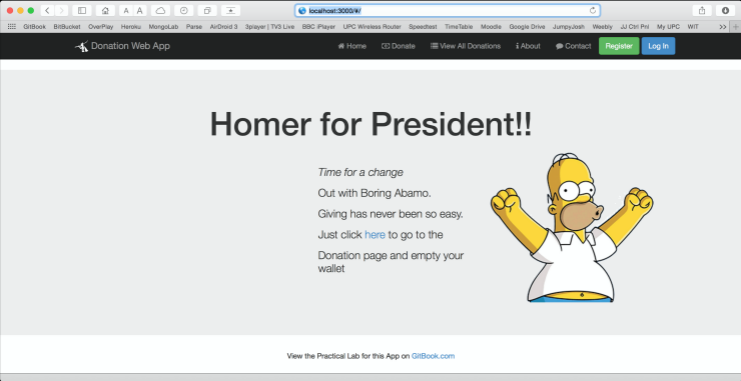

Next Step!

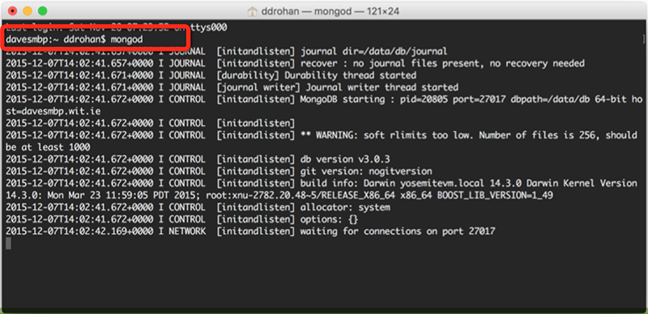

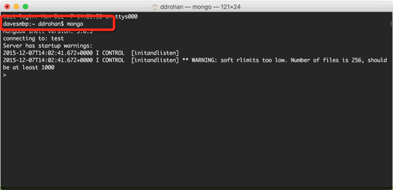

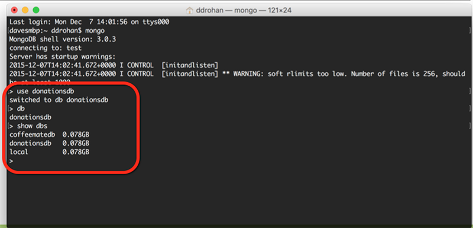

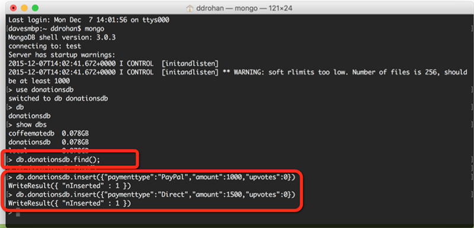

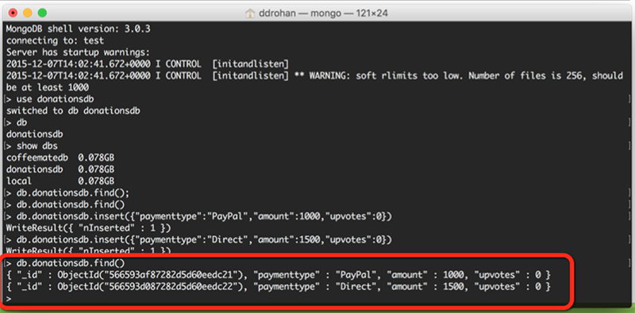

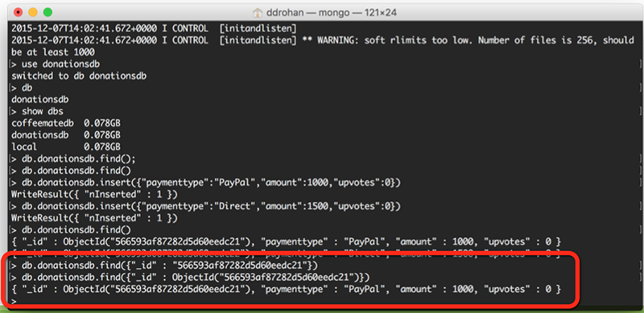

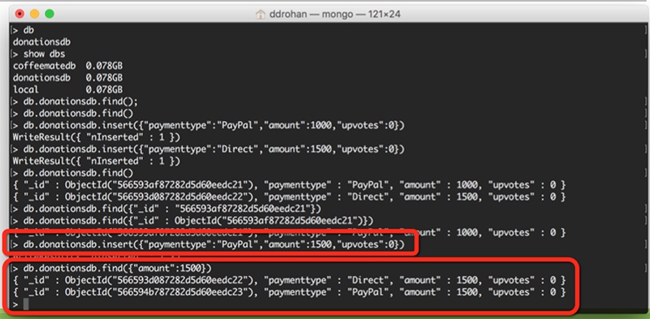

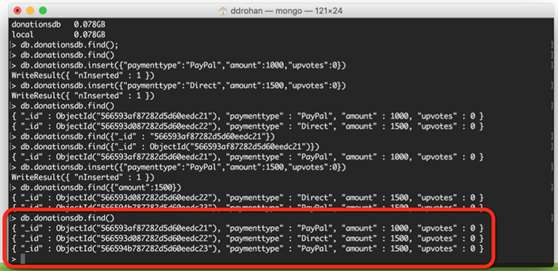

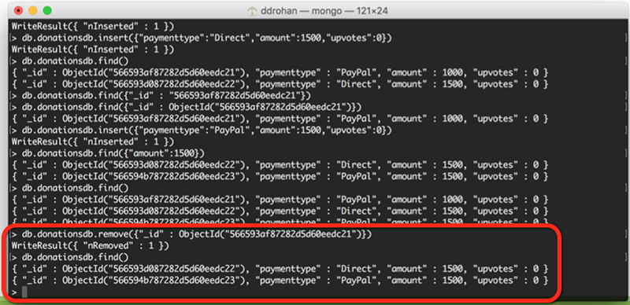

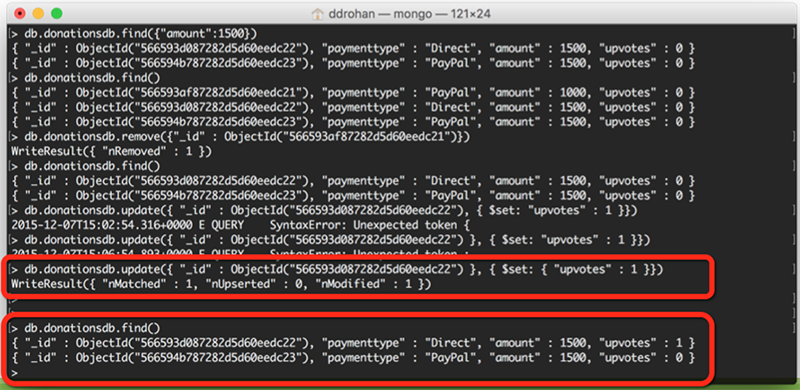