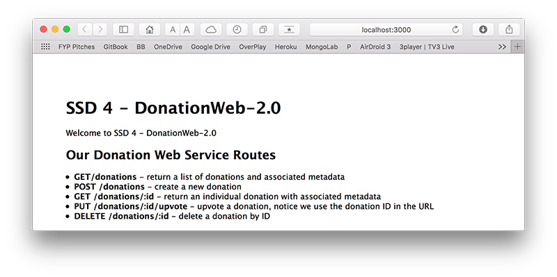

# Step 2 - Setup

First thing you should do is download the starter code (or the solution to the previous lab) **[here](../zips/donationweb-1.0.solution.zip)** and then extract it to your single parent folder for all your web app projects you created for previous labs. 

Rename the extracted folder, (or copy your own version) to **donationweb-2.0**

Open your **donationweb-2.0** web app (in WebStorm) 

and then change your 'title' like so

and launch it.

You may not get any errors, but you should probably reconfigure your project (as it's a copy) and fix the **node modules** path as follows:

Open your preferences and navigate to the **Library** settings

and

update your **node_modules** path to point to the current project

Launch it again, if everything goes to plan you should be able to visit [http://localhost:3000](http://localhost:3000) and you should see the following

The next thing to do is to add the **mongod** and **mongoose** module dependencies to our project. Launch the terminal window 

and run the following commands

~~~
npm install mongoose
~~~

and

~~~
npm install mongodb
~~~

Your project should now look like this

The last step in our 'Setup' is to kick off our localhost mongodb server and insert a few 'Donations' so we can test our refactored 'findAll' function (next step).

Open up a terminal window and launch the mongodb server

Open another, separate window and launch the client

In the client window, create/switch to the 'donationsdb' database

Insert a few records and make sure you name your collection **donations** and **NOT** donationsdb, (as in the screenshots), so you'll be saying something like

~~~
db.donations.find()
~~~

etc.

'Find' all the donations, just to confirm they exist.

