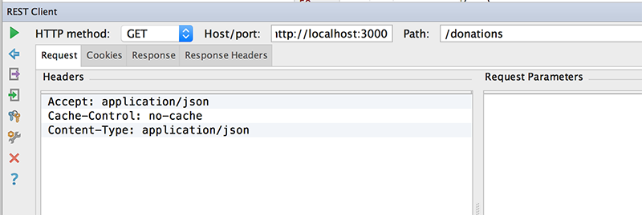
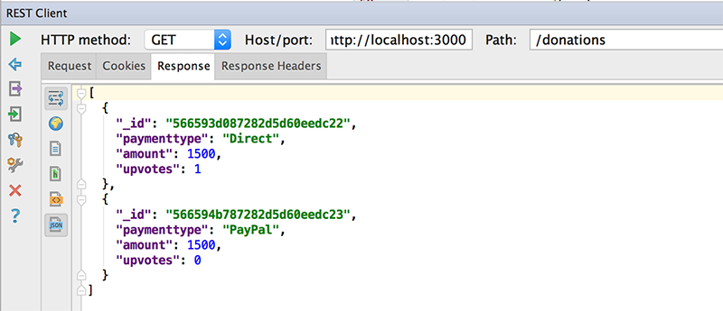
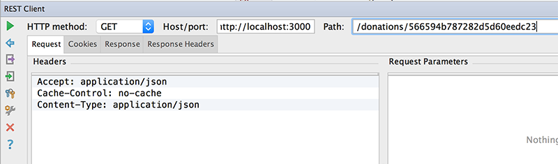
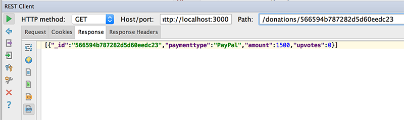
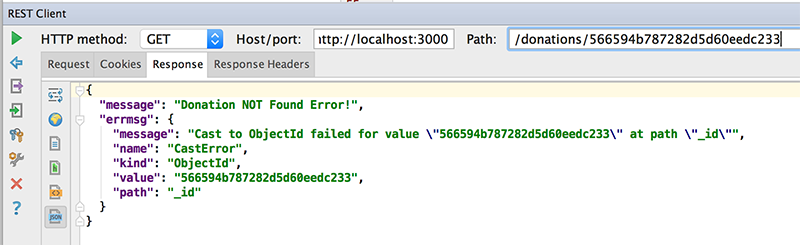

# Step 4 - Modifying our 'Routes', Part 1 ( 'findAll' & 'findOne' )

Our current setup involves pulling data from a javascript object array and storing objects back to that array. We now want to be able to store and retrieve our ***'donations'*** from our mongodb database.

The first thing we'll do is modify our 'findAll' route.

---
## Modifying Our First Route - 'findAll'

Edit your **routes/donations.js** file and navigate to your existing 'findAll' function.

Now, replace it with the following :

```javascript
router.findAll = function(req, res) {
  // Use the Donation model to find all donations
  Donation.find(function(err, donations) {
    if (err)
      res.send(err);

    res.json(donations);
  });
}
```

Notice how we use the Mongoose 'find' function to retrieve all the objects from the 'Model'.

Make sure you have the proper **requires** statement in your routes file

~~~javascript
var Donation = require('../models/donations');
~~~

to include the mongoose schema.

---
### Testing Our 'findAll' Route

###The Request

GETing all the donations in our mongodb database
~~~html
/donations
~~~



###The Response



---
## Modifying Our Second Route - 'findOne'

Our first route returned all the donations to a client, but what if the client only want's to get at a single donation from the database - that's what our next route 'findOne' does, so we need to refactor our current implementation to make use of mongoose.

```javascript
router.findOne = function(req, res) {

    // Use the Donation model to find a single donation
    Donation.find({ "_id" : req.params.id },function(err, donation) {
        if (err)
            res.json({ message: 'Donation NOT Found!', errmsg : err } );
        else
            res.json(donation);
    });
}
```

Notice the use of the **req** parameter to pass in the ***id*** of the donation we require.

---
### Testing Our 'findOne' Route

###The Request

GETing donation with id '566594b787282d5d60eedc23'
~~~html
/donations/566594b787282d5d60eedc23
~~~



###The Response



requesting donation with id '566594b787282d5d60eedc**233**'
~~~html
/donations/566594b787282d5d60eedc233
~~~



---
