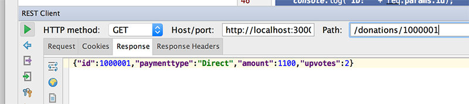

# Step 4 - Modifying our 'Routes', Part 1 ( 'findAll' & 'findOne' )

Our current setup involves pulling data from a javascript object array and storing objects back to that array. We now want to be able to store and retrieve our ***'donations'*** from our mongodb database.

The first thing we'll do is modify our 'findAll' route.

---
## Modifying Our First Route - 'findAll'

Edit your **routes/donations.js** file and navigate to your existing 'findAll' function.

Now, replace it with the following :

```javascript
router.findAll = function(req, res) {
  // Use the Donation model to find all donations
  Donation.find(function(err, donations) {
    if (err)
      res.send(err);

    res.json(donations);
  });
}
```

Notice how we use the Mongoose 'find' function to retrieve all the objects from the 'Model'.

Make sure you have the proper **requires** statement in your routes file

~~~javascript
var Donation = require('../models/donations');
~~~

to include the mongoose schema.

---
### Testing Our 'findAll' Route

###The Request

GETing all the donations in our mongodb database
~~~html
/donations
~~~


###The Response



---
## Creating Our Second Route - 'findOne'

Our first route returned all the donations to a client, but what if the client only want's to get at a single donation - that's what our next route 'findOne' will do.


Here's the function (***findOne***) to be added to our **routes/donations.js** file

```javascript
router.findOne = function(req, res) {

    var donation = getByValue(donations,req.params.id);

    if(donation != null)
        res.json(donation);
    else
        res.json({ message: 'Donation NOT Found!'});
}
```
and our route for **app.js**

```javascript
app.get('/donations/:id', donations.findOne);
```
You've probably noticed (or maybe you didn't!) that there's a 'helper' function (***getByValue***) we need to write for our 'findOne' function to work properly.


Here's the function stub, so see can you work out how to find the donation object in ***arr*** with ***id*** id and return it.

```javascript
function getByValue(arr, id) {

// put your code solution here
    
}
```
---
### Testing Our 'findOne' Route

Now that we have another GET 'service' in our RESTful APi, we should really test it via our REST Client.

###The Request

GETing donation with id '566594b787282d5d60eedc23'
~~~html
/donations/566594b787282d5d60eedc23
~~~


###The Response


requesting donation with id '566594b787282d5d60eedc**20**'
~~~html
/donations/10000011
~~~


---

//////////////////////


