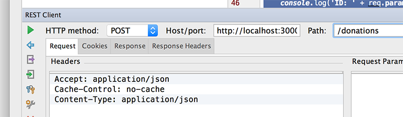
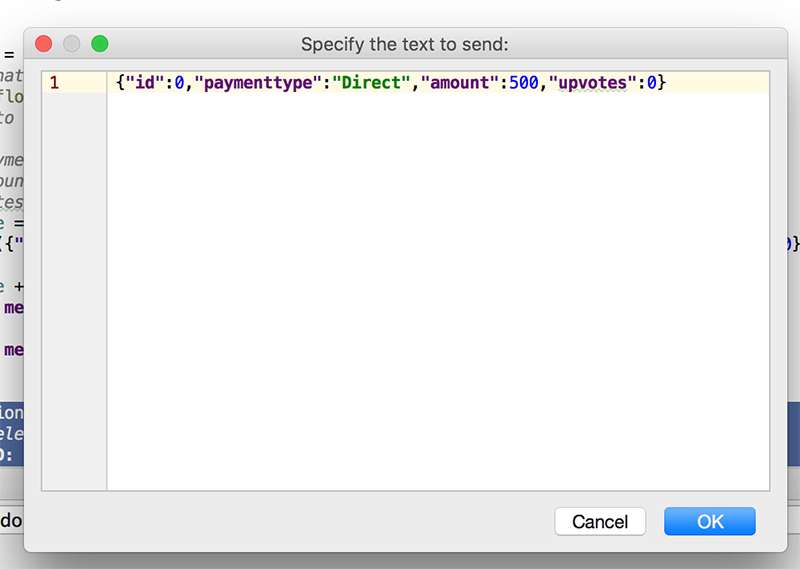
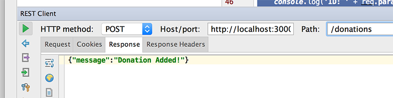

# Step 4 - Modifying our 'Routes', Part 1 ( 'findAll' & 'findOne' )

Our current setup involves pulling data from a javascript object array and storing objects back to that array. We now want to be able to store and retrieve our ***'donations'*** from our mongodb database.

The first thing we'll do is modify our 'findAll' route.

---
## Modifying Our First Route - 'List All Donations'

Edit your **routes/donations.js** file and navigate to your existing 'findAll' function.

Now, replace it with the following :

```javascript
router.findAll = function(req, res) {
  // Use the Donation model to find all donations
  Donation.find(function(err, donations) {
    if (err)
      res.send(err);

    res.json(donations);
  });
}
```

Notice how we use the Mongoose 'find' function to retrieve all the objects from the 'Model'.

Make sure you have the proper **requires** statement in your routes file

~~~javascript
var Donation = require('../models/donations');
~~~

to include the mongoose schema.


---
## Modifying Our Second Route - 'Add a Donation'

Again, edit your **routes/donations.js** file and navigate to your existing 'addDonation' function.

And replace it with the following :

```javascript
router.addDonation = function(req, res) {

    var donation = new Donation();
    
    donation.paymenttype = req.body.paymenttype;
    donation.amount = req.body.amount;

    console.log('Adding donation: ' + JSON.stringify(donation));
    
    // Save the donation and check for errors
  donation.save(function(err) {
    if (err)
      res.send(err);

      res.json({ message: 'Donation Added!', data: donation });
  });
}
```
There's a bit more going on here, so make sure you understand the general jist of how this works. (But I'll explain in the labs anyway)

You may need to restart your server but if everything goes to plan, you should now be able to store and retrieve 'donations' from your mongodb database.


Let's test our **addDonation** using WebStorms REST Client (like before)

---

### Testing Our 'Add' Route


###The Request



We need to fill in the **Request Body** for our POST


POSTing donation data in JSON format

~~~json
{"id":0,"paymenttype":"Direct","amount":500,"upvotes":0}
~~~




###The Response



GET all donations again to confirm


