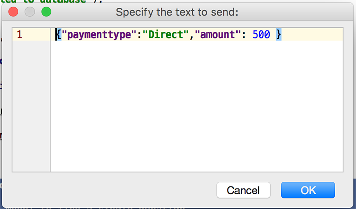
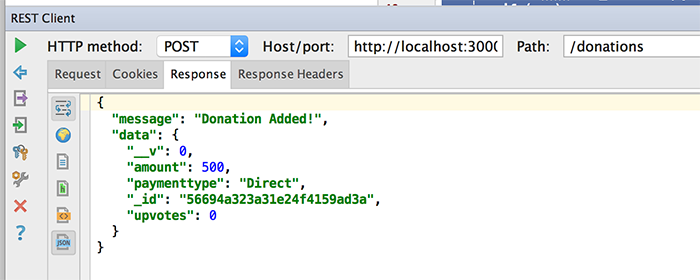
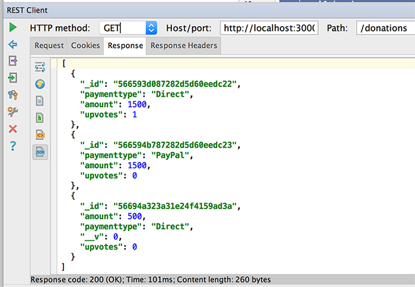

# Step 5 - Modifying our 'Routes', Part 2 ( 'addDonation', 'deleteDonation' & 'incrementVotes' )

## Modifying Our Third Route - 'Add a Donation'

Again, edit your **routes/donations.js** file and navigate to your existing 'addDonation' function.

And replace it with the following :

```javascript
router.addDonation = function(req, res) {

    var donation = new Donation();
    
    donation.paymenttype = req.body.paymenttype;
    donation.amount = req.body.amount;

    console.log('Adding donation: ' + JSON.stringify(donation));
    
    // Save the donation and check for errors
  donation.save(function(err) {
    if (err)
      res.send(err);

      res.json({ message: 'Donation Added!', data: donation });
  });
}
```
There's a bit more going on here, so make sure you understand the general jist of how this works. (But I'll explain in the labs anyway)

You may need to restart your server but if everything goes to plan, you should now be able to store and retrieve 'donations' from your mongodb database.


Let's test our **addDonation** using WebStorms REST Client (like before)

---

### Testing Our 'Add' Route


###The Request


We need to fill in the **Request Body** for our POST


POSTing donation data in JSON format

~~~json
{ "paymenttype":"Direct","amount":500 }
~~~




###The Response



GET all donations again to confirm




---
## Modifying Our Third Route - 'Delete a Donation'

Edit your **routes/donations.js** file and navigate to your existing 'deleteDonation' function.

Now, replace it with the following :

```javascript
router.deleteDonation = function(req, res) {

    var donation = new Donation();

    var id = req.params.id;
    console.log('Deleting donation: ' + id);
    
    Donation.findByIdAndRemove(id, function(err) {
        if (err)
            res.send(err);

        router.findAll(req,res);
  });
}
```

Notice how we use the Mongoose 'findByIdAndRemove' function to retrieve and delete the object from the 'Model'.

---

### Testing Our 'Delete' Route


###The Request


We need to fill in the **Request Body** for our POST


POSTing donation data in JSON format

~~~json
{ "paymenttype":"Direct","amount":500 }
~~~


###The Response


GET all donations again to confirm


---
## Modifying Our Fourth Route - 'Increment Votes'

Again, edit your **routes/donations.js** file and navigate to your existing 'incrementVotes' function.

And replace it with the following :

```javascript
router.incrementUpvotes = function(req, res) {

    var id = req.params.id;
    
    console.log('Incrementing votes for Id: ' + id);
    
    Donation.findById(id, function(err,donation) {
        if (err)
            res.send(err);

        donation.upvotes += 1;
        donation.save(function(err) {
            if (err)
                res.send(err);
            console.log('Votes Incremented: ' + id);
            //res.json({ message: 'Donation Added!', data: donation });
            router.findAll(req,res); 
            }); 

  });
}
```
Like last time, there's a bit more going on here, so make sure you understand the general jist of how this works. (But I'll explain in the labs if necessary?)

You may need to restart your server but if everything goes to plan, you ***might*** now be able to delete and 'upvote' donations from your mongodb database.