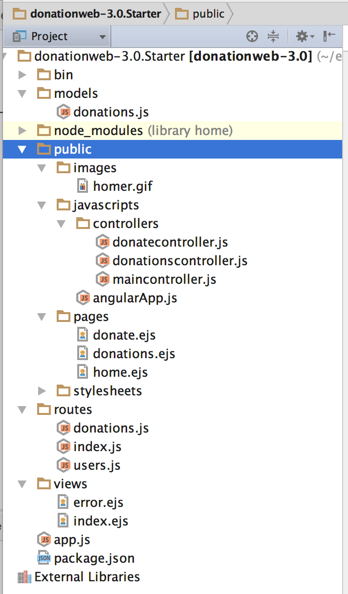
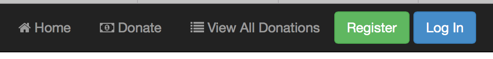

# Step 2 - Setup

First thing you should do is download the starter code **[here](../zips/donationweb-3.0.Starter.zip)** (or continue on with your previous solution and add in the necessary files yourself!) and then extract it somewhere you can access it at the command line easily. I'd recommend creating this project in the single parent folder you have already been using for all your web app projects as we'll need to access these folders quite regularly. 

It's not vital, but you should probably rename the extracted folder, and remove the 'Starter' postfix.

So, once you've extracted the archive (and opened it in WebStorm) you should have something like this.

Pay particular attention to the additional files in the 'public' folder and we'll have a closer look at the individual files as we work through the lab, but first (and to see what our Angular app currently does) you should launch your WebStorm project and view the 'new look' Angular home page in a browser.

## Navigation Bar

You'll notice that the navigation bar has only 3 links, and 2 buttons, like so

diplaying some basic info.

Investigate the code behind these pages and familiarise yourself with how these pages are ***controlled*** as we will build on these concepts in the rest of the lab.

The next few steps involve adding 2 new pages
**
* **About Us**
* **Contact Us**
 

