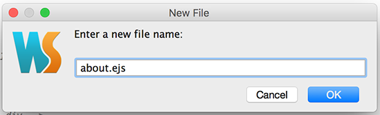

# Step 3 - Implement the 'About Us' Page

This step involves adding another navigation link to our navigation bar to take the user to an 'About Us' page, like so


---

## Updating the Navigation Bar

Adding the link is quite straightforward so open up your **index.ejs** page in your 'views' folder and add the following html code to the list of links

```html
<li><a href="#about"><i class="fa fa-info"></i> About</a></li>

```
Save the file and a quick reboot of the app should display the expected result.

---

##Adding 'about.ejs'

We'll keep this page fairly simple for the moment so create a new file (about.ejs) within the **'pages'** directory/folder of your **'public'** webapp folder and place the following html inside it, 

like so,


and then




```html
<div class="jumbotron text-center">
    <h1>About Us</h1>

    <h2>{{ message }}</h2>
</div>
```
---

##Wiring it all up - the 'About Us' Controller and Routing

This is where most of the work needs to be done in-so-far as we need to  

* create a new ***controller*** object to manage the page and
* add a new ***route*** to ensure the link is correctly associated with the **controller**

###Adding the Controller
First, navigate to your **public/javascripts/controllers** folder and add a new file **aboutcontroller.js**

Add the following code to the file - feel free to change the message!

```javascript
var app = angular.module('DonationWebApp');

app.controller('aboutController', ['$scope', function($scope) {
    // create a message to display in our view
    $scope.message = 'Look, I\'m an About Page!';
    }
]);
```
###Adding the Routing
Finally, within your **angularApp.js** file, navigate to where the other routes have been implemented (around line 4 if you haven't added anything before it)


Add the following code **AFTER** line 10 **AND BEFORE** line 12 (so make some space!)

```javascript
// route for the about page
            .when('/about', {
                templateUrl : 'pages/about.ejs',
                controller  : 'aboutController'
            })
```

Once again, make sure you save your file before you refresh in the browser. If all goes to plan you should now be able to navigate to the **'About Us'** page and see your message displayed.

You're probably not seeing the proper message - can you work out why and how to fix it??
