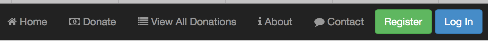

# Step 4 - Implement the 'Contact Us' Page

This step (which is virtually identical to the previous step) involves adding another navigation link to our navigation bar to take the user to a 'Contact Us' page, like so



But here's what you missing from the previous step, if your message didn't show - you need to add the following to your **index.ejs**


```html
<script src="/javascripts/controllers/aboutcontroller.js"></script>
```
---

## Updating the Navigation Bar

Once again, adding the link is quite straightforward so open up your **index.ejs** page and add the following html code to the list of links

```html
<li><a href="#contact"><i class="fa fa-comment"></i> Contact</a></li>

```
Save the file and a quick reboot of the page in your browser should display the expected result.

---

##Adding 'contact.ejs'

We'll again keep this page fairly simple for the moment so follow the same steps as you did for the **about.ejs**.
---

##Wiring it all up - the 'Contact Us' Controller and Routing

This is more or less the same as the previous step as well as we need to  

* create a new ***controller*** object to manage the page and
* add a new ***route*** to ensure the link is correctly associated with the **controller**

So try and have a go at adding the controller ('contactController') and the routes without referring to the previous step. 

Once again, make sure you save your file before you reboot and view in the browser. If all goes to plan you should now be able to navigate to the **'Contact Us'** page and see your message displayed.

**If you're totally stuck you can refer to the lecture material on Angular for a look at the solution we covered in class**.

##Well done - you've just built your 1st Angular Client Web App!


