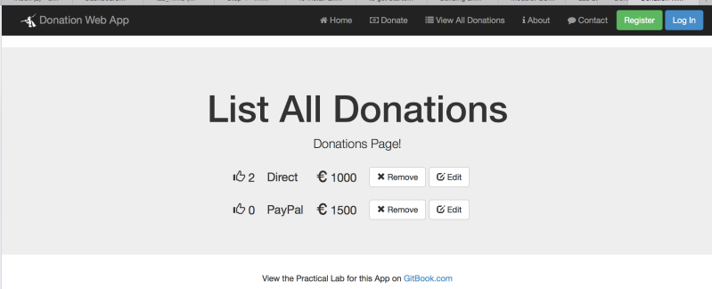
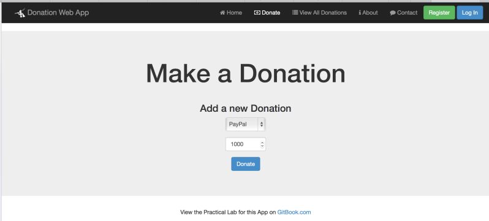

# Lab 5 - DonationWeb 4.0 (MEAN Web App)

This lab involves adding some proper functionality to our Angular Web App - **Donation .0**.

In this lab we'll add the ability to make a Donation and be able to list all the Donations.

Once you've completed the Lab, you're Web App should look something like this

