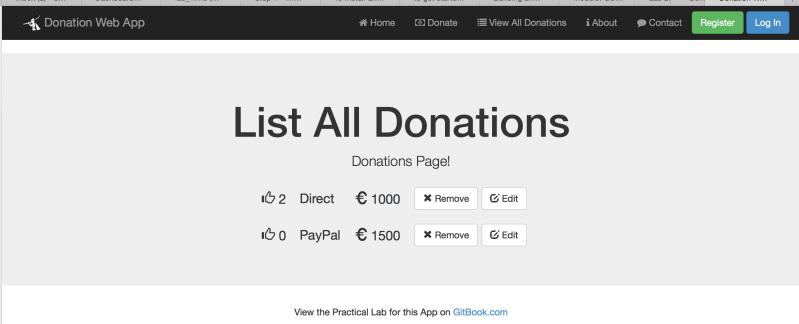
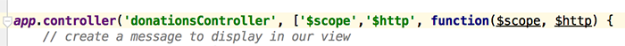
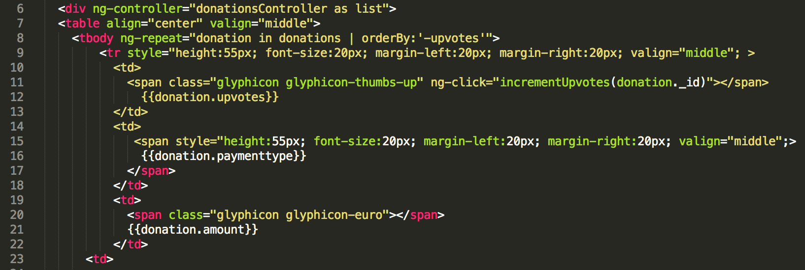

#Step 3 - 'View All Donations'

With any application that will be listing some data it's always a good idea to get the 'Display/list/View All' option implemented first, if for no other reason, to confirm that what you have in the 'app' can be viewed in the 'app' and that you can confirm your 'add' works pretty much instantly.

So the first feature we'll implement is our **'View All Donations'** and list our 'donations' we have stored on the Server (in the mongodb database). Before we start, have a look again at what we want our completed page to look like (or something similar).



We want to initially display the records (just so we know it works) on our page in the format above and also be able to delete the record (and eventually edit it). To achieve this we need to refactor our **'donationsController'** and ***request*** the list from the server - so let's do that.

---

## ***'Requesting'*** our List of Donations

Have a quick look again at your **'donationsController'**, just to familiarise yourself with the **$scope** object you'll be working with.


Now, we need to somehow allow our 'donationsController' make requests so that we can display it on our donations page. We can achieve this through ***Dependency Injection*** so to begin with, add the **$http** dependency to your existing controller like so



and the following http call (within a ***findAll*** function)

```javascript
function findAll() {
        $http.get('/donations')
            .success(function (data) {
                $scope.donations = data;
                console.log(data);
            })
            .error(function (data) {
                console.log('Error: ' + data);
            });
    };
```
Be clear about what is happening here and how we use the ***$scope*** object to allow access in our ***view*** (our donations.ejs).

Your completed **donationsController** should now look something like this


---

## Displaying our 'List of Donations'

Everything we need to display our list of donations is already implemented in our **'donations.ejs'** page (as per the solution) so test it out, but you should investigate how we actually achieve the rendering of the list and familarise yourself with the different ***angular directives*** used in the solution, below is an extract from the page but it's worth having a look at the complete html at some stage.



You should pay particular attention to the following directives

* **ng-controller**
* **ng-repeat**
* **ng-click**

and how we display the individual properties of each donation via the current ***scope***.

And as we're using 

```javascript
                console.log(data);
```

As a final test it's worth opening the Developer Console (will be different depending on which browser you're using) and view 'console' output for example....

