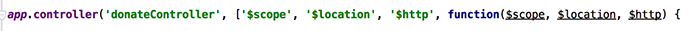

#Step 4 - 'Donate'

So now that we can display a list of the donations currently on the server, the second feature we'll implement is our **'Donate'** option where the user can choose an *amount* and a *payment type*. Before we start, have a look again at what we want our completed page to look like


There's a bit more work involved to get this feature implemented, so the first thing we'll do is write a function to allow us to *add* a donation to our list (stored on the server).

---

## ***'Posting'*** a single Donation

Open up your **donateController** and *inject* the necessary dependencies so that your controller looks like the following



Now we need to implement a function which will 'add' (or post) a donation made, to the server. Here's the majority of the code you need, but try and work out what you need to complete the function (fill in the [...]'s) and where to put it.

```javascript
$scope.addDonation = function(){
        $scope.[...] = ...;
        $http.post('/donations', ...)
            .success(function(data) {
                $scope.[...] = data;
                $location.path('...');
                console.log(data);
            })
            .error(function(data) {
                console.log('Error: ' + data);
            });
    };
```

The next step is to somehow 'wire up' the click of the Donate Button on our view, with the add function you just implemented - we'll achieve this through a ***callback function***.

---

## Updating our *donateController* - the 'addDonation' Callback

Firstly, have a look at our existing donate.html page, and specifically our form 


what function gets triggered when the Donate Button is clicked (when the form is submitted)?

Also, what form **data** is submitted (look for the **ng-model** directives)?

This is the information you need to write the callback function within the controller (below).


To help you along, you'll need to ***inject*** the 'donations' list into the controller (similar to the previous lab with the donationsController) to get access to the list and you'll also need to add the following function to the controller - which you need to complete.

```javascript
$scope.addDonation = function(){
          donations.add(... , ...);
          
      };
```

Once you've completed the 'add' feature, you'll notice that you must manually select the 'View All Donations' link to see your newly added donation. To make thinks a bit more user-friendly we can use the ***$location*** object to *automatically* redirect the user to the page we want.

So if you modify your controller to look something like this


once you add a donation you should be redirected to the relevant page. Again, just be clear about how this is achieved before moving on to the next step.


