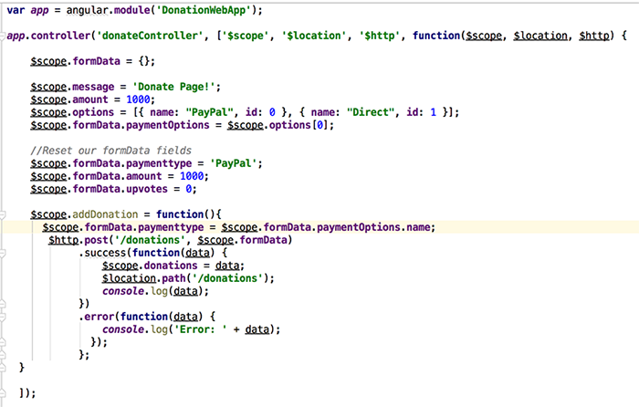
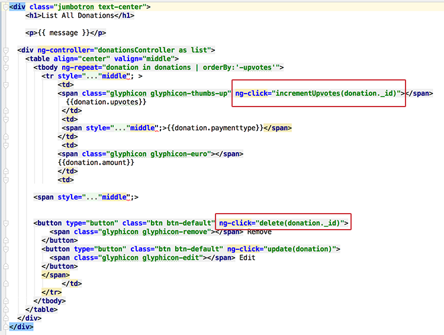
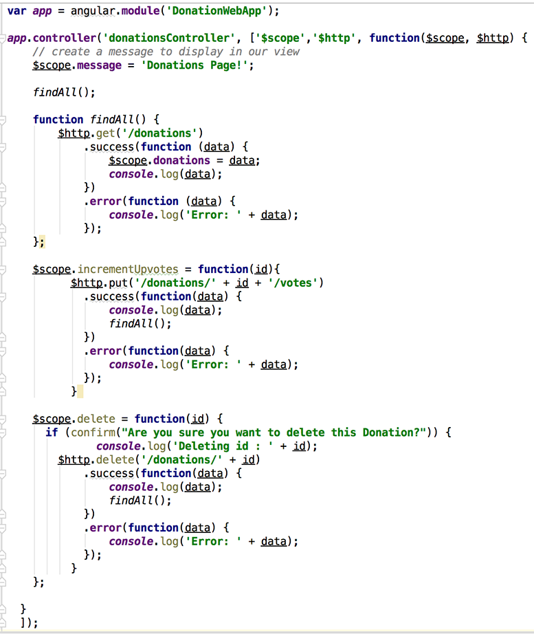

# Step 5 - 'Delete' and 'UpVotes'

Now that we can display a list of our donations and add an individual donation, the final features we need implement (at this stage anyway) is our **'Delete'** option where the user can *Remove* a single donation and also give a donation the *thumbs Up* or increase its **UpVotes**. Before we continue, firstly, here's the solution to the previous step, and what your **donateController** should look like;



And secondly, have a look again at what our donations page looks like


What we need to do here is write 2 functions, one called **delete** to *delete* a donation and another called **incrementUpvotes** to increase its *upvotes* property - both of which need to be added to our **donationsController**.

---

## Updating our *donationsController* - the 'deleteDonation' Callback

Firstly, have a look at our existing donations.ejs page, and specifically the **ng-click** directives associated with the delete button and the 'thumbs Up' glyphicon.



These are the functions you need to write within the donations controller.

To help you along, you need to add the following function to the controller - which you need to complete.

```javascript
  $scope.delete = function(id) {
      if (confirm("Are you sure you want to delete this Donation?")) {
              console.log('Deleting id : ' + id);
        //Write your 'delete' request here
          }
    };
```

Once you've completed the 'delete' feature, save the file and test it out by adding, and then deleting a few donations.

---

## Updating our *donationsController* - the 'incrementUpvotes' Callback

The last feature to implement is to give a particular donation the *thumbs Up*, by implementing the **incrementUpvotes** function in our **controller**.

Here's the stater code...

```javascript
$scope.incrementUpvotes = function(id){
          //Write your 'put' request here
          }
```


**Observe what happens when you click on the thumb icon.... and more importantly how does it work**

---
As a wrap up, your completed **controller** should look like this



## Well Done!!


