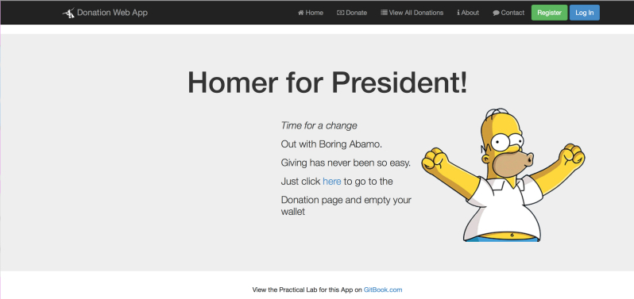

# Lab 1 - Donation 1.0 (Basic Node Web Service)

This lab involves building your 1st Node Web App - **Donation 1.0**.

To begin with, it won't actually do much, but it will give you an introduction to some of the basics of what constitutes a Node Web App, and set up the navigation we need for all the pages in our MEAN Donation Web App.

Once you've completed the Lab, you're Web App should look something like this

