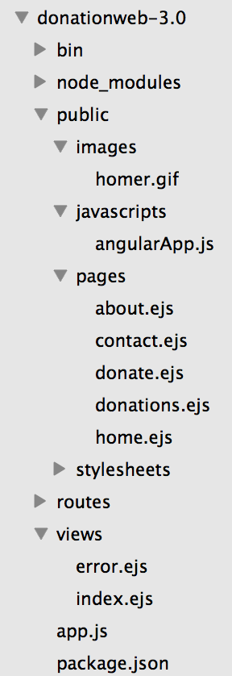

# Step 3 - Importing our Angular Project

Before we make a start on the back-end, we first need to get our front-end setup so this step involves importing our previously implemented Angular app.

First, move the **index.html** file to the ***views/*** directory. Because we're using the **ejs** engine, Node will be looking for files with the *.ejs* extension so we're going to have to rename our **index.html** to **index.ejs**, replacing the existing one.

Next, move the Angular **app.js** file to the ***public/javascripts/*** directory. To avoid confusion with Node's **app.js**, also rename the Angular file to **angularApp.js**.

Finally let's update the script tag in our **index.ejs** file to reflect these changes:

```javascript
<script src="/javascripts/angularApp.js"></script>
```

Now we can start our application by running 

```
npm start

```

If we point our browser to [http://localhost:3000](http://localhost:3000) we should be greeted with the Home Page of our Angular application.

---

## Setting Up the rest of our Angular Pages

You've problably guessed by now that none of the Nav Bar links are working, and we can't even see our homepage, so we need to import and rename all our existing html files to fix this.

To keep things a bit organised, firstly, create a new folder ***pages/*** in the ***public/*** directory. Then copy and rename the rest of our files into this folder ***public/pages/***

Once completed, your project should look something like this



Now, point you browser at [http://localhost:3000](http://localhost:3000) again and see what you get?

It's still not working? Can you figure out the last modification you need to make?

***(Hint - have a closer look at your routing in your angularApp.js)***


