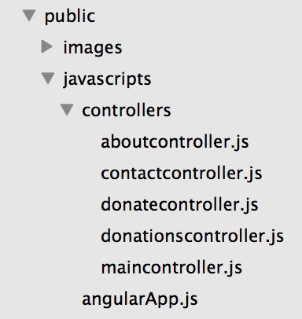

# Step 4 - Refactoring our Controllers

Our current version of Donation isn't fully functional mainly due to the fact that what was originally a client side app has now become a client-server app and we need to restructure how our views are managed (***controlled***).

The first thing we need to do is create a ***seperate controller*** for each of our views so navigate to the ***public/javascripts/*** directory and create a new folder called ***controllers/***.

We need to move all the **controllers** in our single **angularApp.js** file into their own respective files, so create the following inside your ***controllers*** folder



Now, for each controller in our **angularApp.js** move it into its respective file in the ***controllers/*** (as above).

As each controller is going to be in a separate file we will need to add the following line of code to each file

```javascript
var app = angular.module('DonationWebApp');
```
As a start, here's our updated ***aboutcontroller.js***

```javascript
var app = angular.module('DonationWebApp');

app.controller('aboutController', ['$scope', function($scope) {
    // create a message to display in our view
      $scope.message = 'This is the about Page';
     }
  ]);
```
So initially, have a go at ***contactcontroller.js*** and ***maincontroller.js***.

There's a bit more work involved with last two controllers (***donatecontroller.js*** & ***donationscontroller.js***) so we'll complete those separately.

It's probably worth testing your app again just to confirm that the controllers you've updated still work so 

