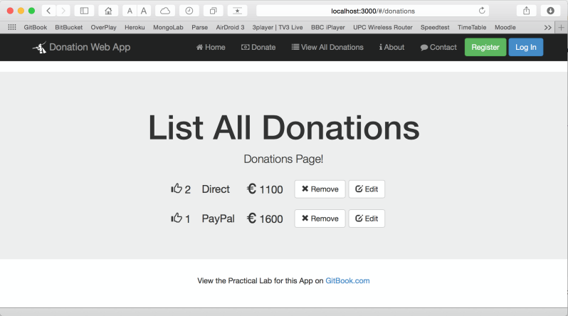

# Step 5 - Updating our Views, Part 1

Now that we have our basic backend implemented, we're going to wire up the angular frontend we developed and imported in previous labs.

Our first step is going to be to query our new backend for all **donations** using the ***donations*** route. We do this by adding a new function inside our **donationscontroller**.

Our current controller looks like this

```javascript
var app = angular.module('DonationWebApp');

app.controller('donationsController', ['$scope','donations', function($scope, donations) {
    // create a message to display in our view
    $scope.message = 'Donations Page!';
    $scope.donations = donations;

      $scope.delete = function(donation){
      if (confirm("Are you sure you want to delete? : ")) {
          donations.deleteDonation(donation);
         }       
      };

        $scope.incrementUpvotes = function(donation){
          donations.incrementUpvotes(donation);
      };
  }
  ]);
```
So go ahead and delete the two existing **$scope** functions and replace them with the following

```javascript
$http.get('/donations')
        .success(function(data) {
            $scope.donations = data;
            console.log(data);
        })
        .error(function(data) {
            console.log('Error: ' + data);
        });
```
We're using the **$http** object so you need to make sure you ***inject*** this into your controller and also remove the **donations** object previously injected as this is the angular object - which doesn't exist anymore!

Now, as we already have data in our Model, (which we tested in the previous step) point the browser at [http://localhost:3000/](http://localhost:3000/), navigate to the 'View All Donations' page and we should see the following





